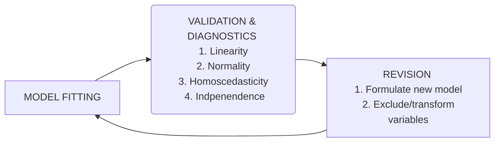

# Investigation of Real Estate Pricing in Hot Coffee, Mississippi. 

*Prepared by Evgeny Noi as part of the final project for PSTAT 220A*

---

## Executive Summary

* point A
* point B
* point C 

## Introduction 

The residential real estate pricing depends on many factors that potentially make the property more attractive for living. Traditionally prime real estate is valued for proximity to transportation, educational, healthcare and recreational services, while being far enough from land uses that are considered undesirable (brownfield, industrial areas, production sites, landfills). This report builds a price-predicting model to help the city government of Hot Coffee, Mississippi improve the appraisal of the monetary value of properties located within the city limits.

## Data 

The following predictors were assessed in this report: size of property (in square meters), age (in years), dc (distance to city center in km), dt (distance to a toxic waste disposal in km). The prediction was made for a listed price measure in thousand of dollars. All of our variables are continuous, there are no missing or incomplete records. Please see a data sample below for further reference. We notice near normal distribution for the size, dc and price, the age is distributed according to a zero-inflated Poisson, while df is bimodal (Figure 1). 

| size  | age  | distance_to_center | distance_to_waste | price |
| ----- | ---- | ------------------ | ----------------- | ----- |
| 102.2 | 4.1  | 0.8                | 50.2              | 472.0 |
| 102.7 | 16.0 | 5.5                | 51.4              | 660.1 |
| 101.1 | 6.8  | 14.7               | 29.1              | 683.0 |

To investigate potential relations between predictors and dependent variable the matrix plot was constructed (see below). First thing we notice, is that the largest correlation ($\rho=0.539$) is between between *price* and *size*, which is not surprising as bigger homes are usually more expensive. Second, almost as large is the negative correlation between the *size* and *distance to the toxic waste disposal site* ($\rho=-0.432$), meaning lower prices at the greater distance to the site. This last association is counter-intuitive because the correlation assumes linear relationship between variables, when, in fact it can be very non-linear or be under effect of some confounding variable absent from our dataset. Overall, none of our variables have high enough correlation ($\rho>0.7$ ) to point to collinearity, but further examination is warranted. 

<figure> 
    

	  
    <figcaption> Figure 1: Matrix Plot of Data. </figcaption> 
    

</figure>

## Methods 

We utilize linear regression to build a pricing model. Linear models (LM) are very stable if used right and unlike some advanced ML tools, they provide interpretable results. Generally, regression model can be represented as follows:   
$$
\begin{align}
y = X\beta + \epsilon, \label{eq1}
\end{align}
$$
where $X$ are independent predictors (size, age, dc, dt), $y$ is a dependent variable (home price), $\epsilon$ is an error term ($N(0, \sigma^2)$), and $\beta$ are the estimated parameters fitted via ordinary least squares (OLS - see Equation $\ref{eq2}$). 
$$
\begin{align}
\beta = (X^TX)^{-1}X^Ty, \label{eq2}
\end{align}
$$
The analytical framework pursued in this report is outlined below. First, model is formulated and fitted using the statistical packages. Second, regression model is validated against outlined assumptions.  Next, if necessary, the model is revised to include or transform any variables. Finally the model is re-fitted and the whole cycles is repeated. 

To assess model validity we test linear regression assumptions. Table 333 list such tests employed in this report.  

| N    | LM Assumption                   | Test                                                      |
| ---- | ------------------------------- | --------------------------------------------------------- |
| 1    | Linearity / Constant Variance   | observed vs predicted plots, residuals vs predicted plots |
| 2    | Normality                       | normal quantile plot of residuals                         |
| 3    | Homoscedasticity                |                                                           |
| 4    | Independence                    |                                                           |
| 5    | Overfitting                     | k-fold cross-validation                                   |
| 6    | Lurking / confounding variables |                                                           |

Next, the overall fit is assessed using the following criteria: predictor p-values, Adjusted R-squared, AIC, BIC, cross-validation and lasso. 

| Model          | Adjusted R-Squared |      |      |
| -------------- | ------------------ | ---- | ---- |
| $\alpha$-model |                    |      |      |
| $\Beta$        |                    |      |      |
| $\Gamma$       |                    |      |      |

All analysis is performed in using R-language and R-studio IDE. 

## Results 

Model $\Alpha$ is significant 

## Discussion and Limitations

lorem 

## Appendix 

<figure> 
    

     
    <figcaption> Fig.1 My figure 1 </figcaption> 
    

</figure>

